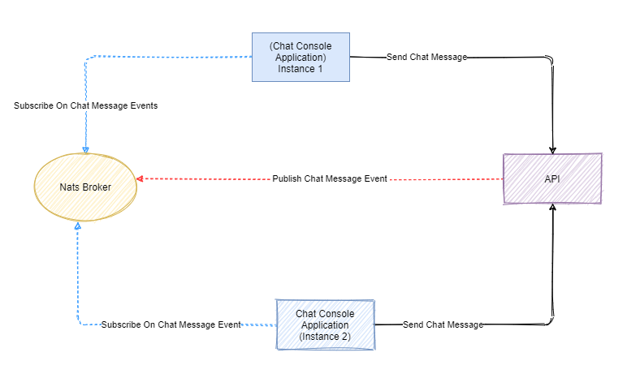

# Chat Application

## How To Run
For running Nats message broker in your system you can use of this [docker compose](./deploys/compose/docker-compose.yaml) file.

For running our system we need to run our [Console Application](./src/Chat.Console) as client and [API](./src/Chat.Api) as a service. we can use bellow command in root of project with shell to running our clients and api. Our api will up and running on this `http://localhost:8000` address.

``` cmd
.\scripts\backend-api.bat
.\scripts\console-ui.bat
```
we can create multiple instance of console application as our chat UI and we can chat between these separated console instances, we have to run `.\scripts\console-ui.bat` multiple to create multiple instance of chat application.

## Chat Architecture Diagram



In above diagram I show how our components connect together for running this chat application. Here we have two console application or two instance of console application as our Chat UI, one NATS message broker and one API service for get and post some data.

The flow of our application is like this:

- Our first console application (instance 1) as Chat UI sends a message data to our API service.
- Our API endpoint will get posted message from the client and process and save this message in a in-memory storage (EF-Core In-memory) and then publish this message as a event to our NATS message broker. This message contain needed information for our subscribers for example `sender` , `receiver`, `message` and our subscribers can pick their needed information from theses events.

- Our second console application (instance 2) as Chat UI, that is subscribed to that event through our NATS message broker, receives this message from the broker and will show on the console.
